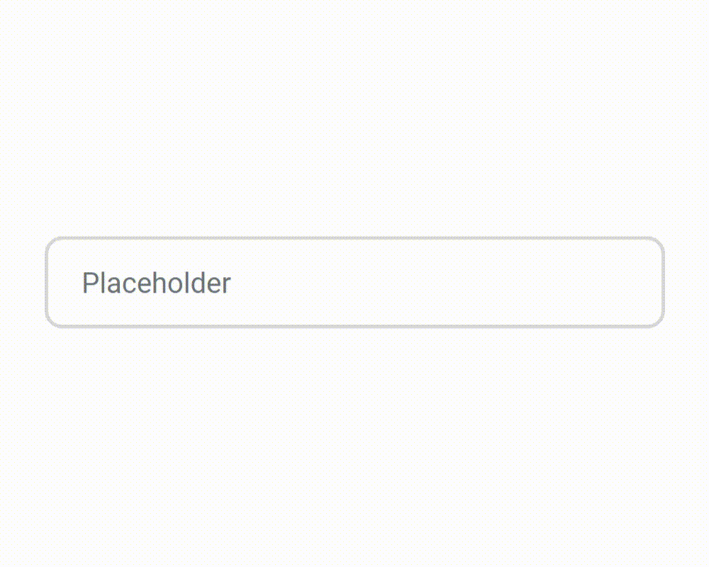

<!-- Top Image and Title -->

	
	<h1>Placeholder animated</h1>
	<!-- Subtitle/Description -->
	<h4>Input placeholder animation like a Gmail Login </h4>

<!-- Image Shields -->

	
	
	
	

<!-- Nav Menu -->

	<a  href=#telescope-tecnologias>Technologies</a>&nbsp&nbsp|&nbsp&nbsp<a  href="#memo-licença">License</a>  
	<!---->

### :telescope: Technologies

- [HTML5](https://developer.mozilla.org/pt-BR/docs/Web/HTML)

- [CSS3](https://developer.mozilla.org/pt-BR/docs/Web/CSS)

---

### :memo: License

- :balance_scale: MIT License - [About](https://github.com/joaovictornsv/placeholder-animated/blob/master/LICENSE)
